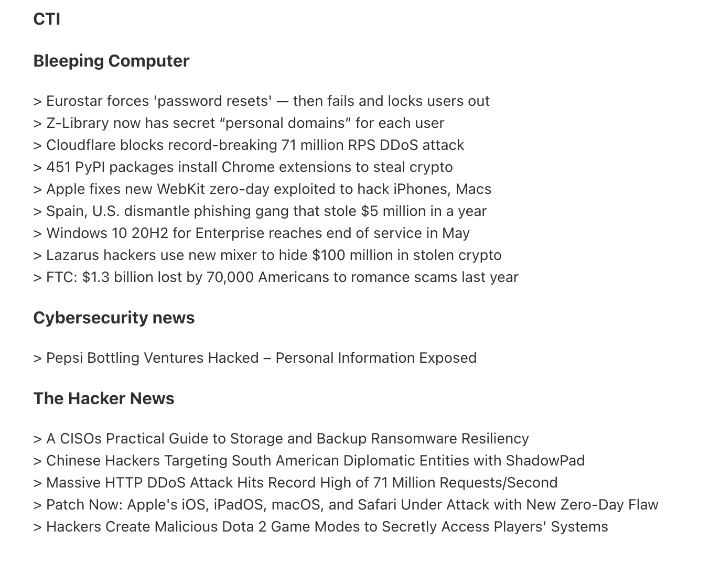

# newsletter
> Automated newsletter for rss feeds

## How to use

### Feeds
Rss feeds are in [feeds/yaml](feeds.yaml).

Feeds.yaml format:
```yaml
categories:
  - name: "Cat 1"
    sources:
      - title: "Feed1"
        url: "http://domain/feed"
      - title: "Feed2"
        url: "http://domain/feed"
      - title: "Feed3"
        url: "http://domain/feed"

  - name: "Cat 2"
    sources:
      - title: "FeedA"
        url: "http://domain/feed"
      - title: "FeedB"
        url: "http://domain/feed"

```

### Receiver

All the receiver should be declared in [receiver.yaml](/) with the syntax:
```yaml
receivers:
- receiver1@domain
- receiver2@domain
- receiver3@domain
```

### Env

The following env variables should be set:
```bash
RUST_LOG=info #log level
USERNAME= #sender email 
PASSWORD= #sender password
PUB_TIME=-N #Time before the last post in day
```

### Run
Compile and run or run durectly with ```cargo run```


## Result

Exemple of result : 


## My usage 
I use this script with sheduled github action, to receive everyday my cybersecurity-watch :
```yaml
name: Send Newsletter

on:
  schedule:
  - cron: "0 6 * * *"

jobs:
  ...
```
